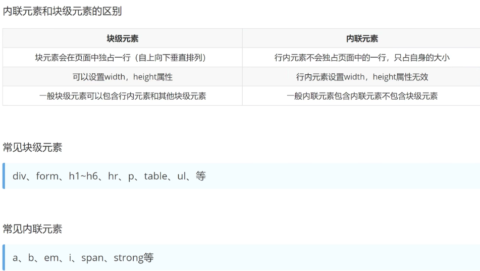
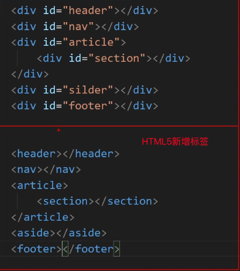

# 基础标签与骨架
## 1. 骨架
* DOCTYPE声明：保证样式在不同浏览器之间的兼容 <!DOCTYPE html>
* html标签：告知浏览器这是个HTML文档
* head标签：描述文档属性和信息给浏览器看
  * meta标签：描述网页文档属性，例如utf-8编码，单标签
  * title标签：网页标题，满足SEO（搜索引擎）优化
* body标签：包含文档所有内容，给用户看的，例如图片、超链接、表格等
## 2. 标签
### 2.1 标题 h1-6
* 标题标签：h1-h6,h1最大，h6最小
* 属性：align,选择展示在页面的位置,left（默认）\center\right
* 按照重要程度来使用h1-6
### 2.2 段落 p
### 2.3 换行 br
### 2.4 水平线 hr
* 颜色属性：color
* 水平线宽度：width px像素
* 水平线高度：size px像素
* 水平线位置：align left\center(默认)\right
### 2.5 图片 img
* src属性：选择的图片路径
  * 相对路径：两者相对关系
    * 子集:/
    * 父集：../
    * 同级：./或者直接写图片名称
  * 绝对路径：浏览器直接用html文件的绝对路径打开，则图片的绝对路径可以展示，如果用localhost打开，图片绝对路径失效
  * 网络路径：https://xxxxx
* alt属性：规定图像的替代文本，如果不写这个属性，可能会影响其他属性的展示，当图片不显示时显示的文本（safari浏览器时效，谷歌可以）
* width属性：规定图像宽度 如果不写，alt属性safari浏览器会显示失败，但是谷歌正常
* height属性：规定图像高度 一半只规定width，如果规定height会导致部分图片拉伸失帧
* title属性：鼠标悬停在图片上给予提示 如果alr属性不写则该属性失效
### 2.6 超文本链接 a
* href属性：跳转地址，必须写，不然只当文本处理，根据是否点击过，链接颜色会改变，可以根据css来定义
### 2.7 文本 
* em:定义着重文字
* b:粗体文本
* i:斜体文字
* strong:加重语气
* del:删除
* span:无其他特殊定义
### 2.8 列表 
* 使用：
  * 列表
  * 无序列表导航
* ol标签嵌套li标签：有序列表页面展示1234有序 <ol><i></i></ol>
  * type属性（ol属性)：type="a"或者"A"或者"I"或者"i"
  * li标签内可以嵌套其他标签
* ul标签嵌套li标签：无序列表
  * type属性(ul属性)：type="disc"实心圆，"circle"空心圆，"square"小方块，"none"不显示
  * li标签内可以嵌套其他标签
### 2.9 表格
* 表格:table
  * border：设置表格边框
  * width:表格宽度
  * height:表格高度
* 行：tr
* 列：td
  * colspan="水平要合并的数量"，保留左删除右
  * rowspan="垂直要合并的数量"，保留上删除下
  * 如果即使用colspan又用rowspan，如果先横合并后按照横的数量纵向合并
### 3.10 表单 form
* action属性：传给服务器地址
* name属性：名称
* method:Get提交少量数据或者Post提交大量数据
* 元素
  * 表单标签
  * 表单域 type:text文本或者submit或者password密码隐藏输入
  * 表单按钮 提交表单
### 3.11 块元素与行内元素

### 3.12 html5新增标签
